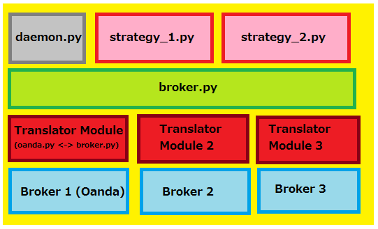

日本語図表：[こちら](docs/platform_diagram_jp.png)

# Algorithmic Trading Platform

## What is this?

This project is a modular platform for running multiple algorithmic trading strategies concurrently.

As of 2018-08-18, the platform is functional. However, it is hardly optimized nor ready for production. A basic backtesting framework is in place; see `/src/backtesting/`.

You can develop your own strategy module and run it with this platform. Developing a module is very straightforward; copy a strategy from `/src/strategies/` and implement your own logic in `_babysit()` and `_scan()`.

You can use this platform with any broker API. There are two steps to integrate your broker's API:

1. Supply a wrapper module that calls your API and can be called by this platform. Your broker may already provide one. `Oanda.py` exists for Oanda's v20 REST API.
2. Tweak the generic methods in `broker.py` to call your wrapper and correctly pass return values back to the platform.

## Technical introduction

- This is a command line application for Linux. The Debian operating system is being used for development.
- Python 3.6 is used for the bulk of the program currently (`/src/`). The database is MySQL (`/src/db/`). There are some shell scripts in `/src/scripts/`.
- There are three pieces to this project, as with any algorithmic trading: backtesting, forward testing, and live trading.

## How to use

Before you being using the platform, you will need to do some configuration.

- You will need to make your own private config file. See `Config.py` for details.
- You will need to create the MySQL database on your machine. There is a backup script for the purpose of recreating the database. It is in `/src/db/db_backup.mysql`. It may or may not be up to date.
- Tweak `daemon.py` to use the strategies you created.

Run the platform:

`$ cd src`  
`$ python3 main.py`

Run unit tests:

`$ cd src`  
`$ bash tests/run_tests.sh` 

## Backtesting

See `/src/backtesting/`

## Forward Testing

Toggle the `live_trading` setting in the public config file to `False`.

If False, the Oanda module will use its Practice Mode with fake money.

## Live Trading

Toggle the `live_trading` setting in the public config file to `True`.

## Platform Design: Scalability and Modularity

- Scalability and user-friendliness take priority over speed. This is not intended to be used for high-frequency trading and/or arbitrage. The `chart.py` module, for example, will have some methods to do technical analysis.
- The strategy modules can be used (or not used) arbitrarily. Just modify the startup portion of `daemon.py` to include your module in the list of strategies.
- `daemon.py` and the strategy modules make calls to a generic `broker.py` module, which then delegates the calls to a wrapper module, e.g. `oanda.py` wraps Oanda's API. Having the generic broker layer allows you to conveniently change the broker you use.
- Things like money management and risk management happen in `daemon.py`. The strategy modules are intended to be "dumb" and only observe prices and make trades.

Here is a diagram of the layers.

- The daemon listens to the strategies and allocates money to them.
- The daemon does not talk to the broker's API directly. Rather, it uses the generic `broker.py` module.
- The broker module calls the broker-specific wrapper that is being used, e.g. `Oanda.py`.

